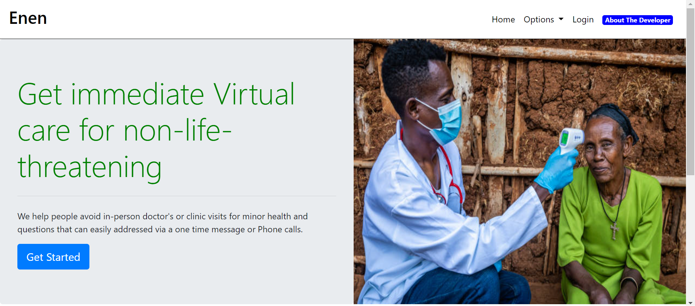
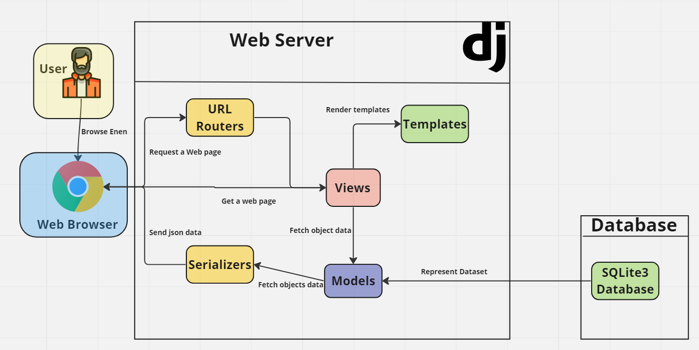
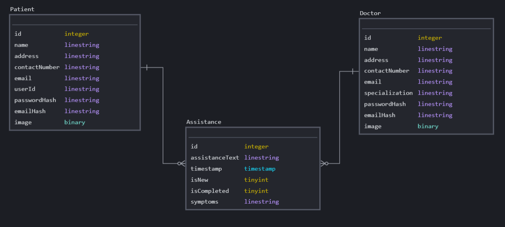

# Enen


## Introduction 🤔
__Enen__ is a simple web application that connects people with immediate virtual care for non-life-threatening illnesses and injuries. This app helps people avoid in-person doctor’s or clinic visits for minor health issues and questions that can easily be addressed via a one time Message or Phone calls. It connects users with remote physicians and doctors, providing convenient and accessible healthcare from the comfort of their own homes.

> Do you want to know why i named my project `Enen`?🤷🏽‍♂️ Well....

> The word `Enen` is a common and versatile expression in Amharic Language that is used to convey comfort, sympathy, or empathy. It is often used when someone is experiencing physical or emotional pain, and can be used to show that the speaker cares and wants to offer support.

> For example, if a child falls and scrapes their knee, a mother might say `enen` while comforting the child and tending to their injury. Similarly, if someone is upset or crying, a friend might say `enen` to show that they understand and want to offer support.

> The expression can also be used in other situations where someone is experiencing discomfort or distress. For example, if someone is feeling cold, a friend might offer them a blanket and say `enen` to show that they care and want to help.

<p align="center">
  
</p>

## Live Site 🕸️
__Website Link__: [Enen](http://enen.bekalue.tech/)

__You like it right ?!__ 😆 now connect with me on **[Linkedin](https://www.linkedin.com/in/bekalue/)**

## Key Features ⭐

- User authentication and registration
- Interface for interaction of Doctors and Users through the Request and Recieve Help portal
- User profile and Information
- History of Interaction between Doctor And User
- Show users for available Doctors And their Phone Numbers
- API routes that enables a web client to communicate with web server

## Technologies Used 💻

- Django
- HTML/CSS/Javascript
- Bootstrap
- SQLite

## Architecture 📐✏️

This project is built using the Django framework and consists of a database, models, views, templates, and serializers for accessing API JSON models. Data is stored in a SQLite3 database located in the project’s base directory. The web client is built using Django’s template system and communicates with the backend to fetch data and render views. The web client serves as the primary interface for accessing Enen. The image below illustrates the data flow within the project.

<p align="center">
  
</p>

### Data Model

The data model for this project defines three classes: `Doctor`, `Patient`, and `Assistance`, which represent doctors, patients (registered users seeking medical attention), and assistance records, respectively. These classes are subclasses of Django’s Model class and define the structure of the database tables used to store information about doctors, patients, and assistance records.

The `Doctor` class has several fields that store information about a doctor, including their name, address, contact number, email address, specialization, password hash, email hash, and profile image.

The `Patient` class has similar fields to the `Doctor` class but also includes a `userId` field that stores a unique identifier for each patient or registered user.

The `Assistance` class represents an assistance record and has fields for storing the assistance text, the doctor and patient associated with the record (represented as foreign keys), the timestamp of when the record was created, whether the record is new or not (represented as a boolean), whether the record is completed or not (represented as a boolean), and the symptoms or case associated with the record.

These classes define the structure of the database tables used to store information about doctors, patients, and assistance records in this Django application.

<p align="center">
  
</p>

## Getting Started 💁🏽
### Windows Powershell
```powershell
git clone https://github.com/bekalue/Enen.git
cd Enen
.\env\bin\Activate.ps1                        (To activate virtual environment)
pip install -r requirements.txt               (To Install all The dependencies)
cd enen
py manage.py runserver
```
To deactivate the virtual environment on powershell, simply type:
```powershell
deactivate
```
### Linux Ubuntu 20.04.6 LTS
```shell
git clone https://github.com/bekalue/Enen.git
cd Enen
source ./env/bin/activate                        (To activate virtual environment)
cd enen
pip install django
pip install pycrypto
pip install -r requirements.txt
python3 manage.py runserver
```
To deactivate the virtual environment on Ubuntu, simply type:
```powershell
deactivate
```

## Discussion 💬

+ Discuss Enen on [GitHub Discussions](https://github.com/bekalue/Enen/discussions)

## Related Projects ⏭️🚶🏽‍♂️

+ [HBNB](https://github.com/bekalue/AirBnB_clone_v4)

## Contributing 🧑🏽‍💼

I welcome contributions to enen! Please see my [contribution file](CONTRIBUTING.md) for more information on how to get started.

## Code of Conduct 🧐

I am committed to providing a welcoming and inclusive environment for all contributors. Please see my [code of conduct](CODE_OF_CONDUCT.md) for more information.

## Acknowledgement🫂

I would like to express my sincere gratitude to the mentors at the **[ALX Software Engineering Program](https://www.alxafrica.com/software-engineering/)** for their guidance and support throughout the program and development of this project. Their expertise and insights have been invaluable in helping me overcome challenges and achieve my goals.

I would also like to thank my fellow students in cohort 9 for their camaraderie and collaboration. Their feedback and encouragement have been instrumental in helping me grow and improve as a developer.

In addition, I would like to thank the online community for their willingness to answer my questions and provide guidance when I needed it. Their knowledge and expertise have been a valuable resource in helping me overcome obstacles and make progress on my project.

Finally, I would like to thank you, the reader, for taking the time to learn about this project. Your interest and feedback are greatly appreciated.

Thank you all for your support and encouragement! 🙏🏽🤗

## Licensing 🪪

Enen is licensed under the [MIT LICENSE](LICENSE).
